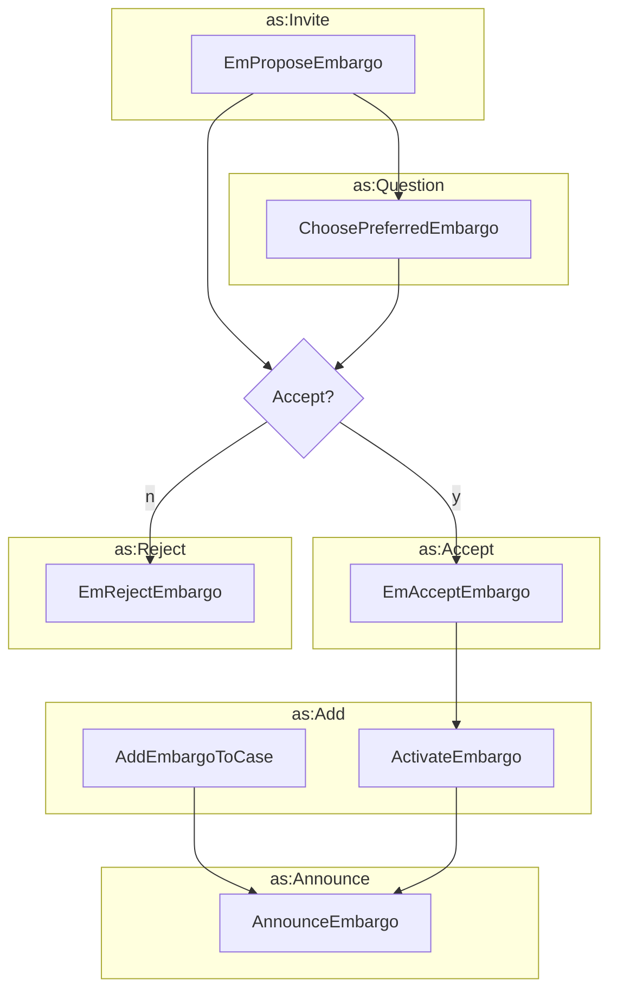

# Establishing an Embargo



## Propose Embargo

An actor proposes an embargo to a case.

```python exec="true" idprefix=""
from vultron.scripts.vocab_examples import propose_embargo, json2md

print(json2md(propose_embargo()))
```

## Choose Preferred Embargo

The vendor asks participants to choose an embargo from a list of embargo options.

```python exec="true" idprefix=""
from vultron.scripts.vocab_examples import choose_preferred_embargo, json2md

print(json2md(choose_preferred_embargo()))
```

## Accept Embargo

An actor accepts an embargo proposal.

```python exec="true" idprefix=""
from vultron.scripts.vocab_examples import accept_embargo, json2md

print(json2md(accept_embargo()))
```


## Reject Embargo

An actor rejects an embargo proposal.

```python exec="true" idprefix=""
from vultron.scripts.vocab_examples import reject_embargo, json2md

print(json2md(reject_embargo()))
```

## Add Embargo to Case

The case owner adds an embargo to the case. This is the generic form of activating an embargo,
and is mainly included to allow for a case owner to add an embargo to a case without having to
first propose the embargo to the case.
In most cases, the case owner will activate an embargo in response to an embargo proposal 
(see [Activate Embargp](#activate-embargo).

```python exec="true" idprefix=""
from vultron.scripts.vocab_examples import add_embargo_to_case, json2md

print(json2md(add_embargo_to_case()))
```

## Activate Embargo

The case owner activates an embargo. This is a special case of adding an embargo to a case,
performed in reply to an embargo proposal.

```python exec="true" idprefix=""
from vultron.scripts.vocab_examples import activate_embargo, json2md

print(json2md(activate_embargo()))
```

## Announce Embargo

The case owner announces an embargo to the case. This is meant to remind case participants of the embargo terms.

```python exec="true" idprefix=""
from vultron.scripts.vocab_examples import announce_embargo, json2md

print(json2md(announce_embargo()))
```


