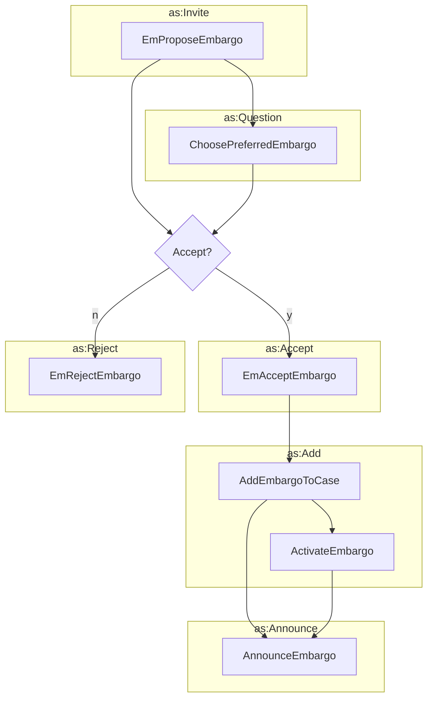

# Establishing an Embargo

```mermaid
flowchart TB
    subgraph as:Invite
        EmProposeEmbargo
    end
    subgraph as:Question
        ChoosePreferredEmbargo
    end
    subgraph as:Accept
        EmAcceptEmbargo
    end
    subgraph as:Reject
        EmRejectEmbargo
    end
    subgraph as:Announce
        AnnounceEmbargo
    end
    subgraph as:Add
        ActivateEmbargo
        AddEmbargoToCase
    end
    EmProposeEmbargo --> a{Accept?}
    a -->|y| EmAcceptEmbargo
    a -->|n| EmRejectEmbargo
    EmProposeEmbargo --> ChoosePreferredEmbargo
    ChoosePreferredEmbargo --> a
    AddEmbargoToCase --> ActivateEmbargo
    EmAcceptEmbargo --> AddEmbargoToCase
    AddEmbargoToCase --> AnnounceEmbargo
    ActivateEmbargo --> AnnounceEmbargo
```
