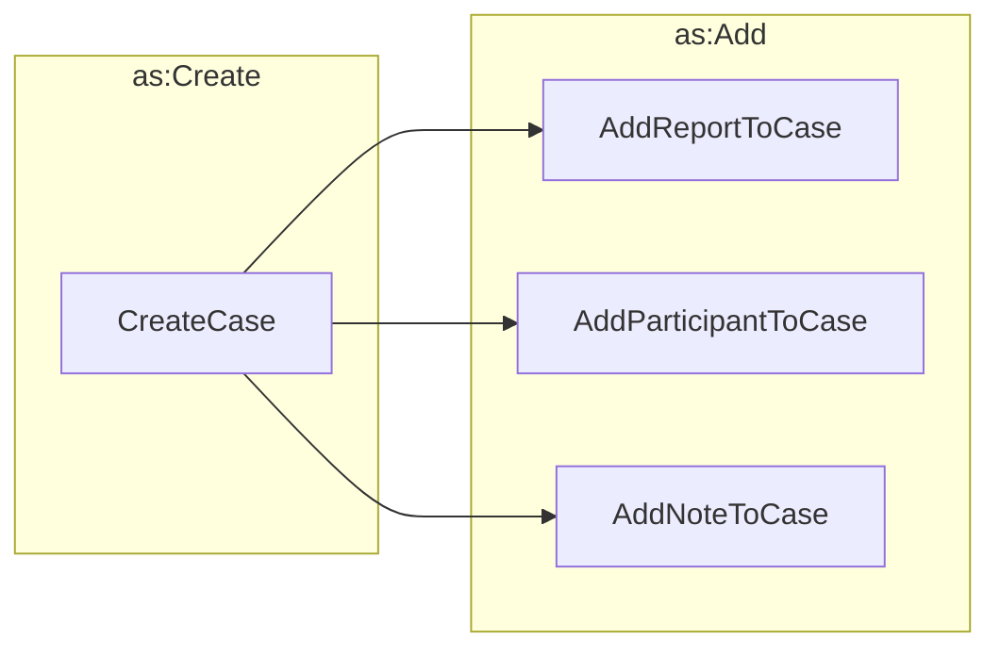

# Initializing a Case

```mermaid
flowchart LR
    subgraph as:Create
        CreateCase
    end
    subgraph as:Add
        AddReportToCase
        AddParticipantToCase
        AddNoteToCase
    end
    CreateCase --> AddReportToCase
    CreateCase --> AddParticipantToCase
    CreateCase --> AddNoteToCase
```





