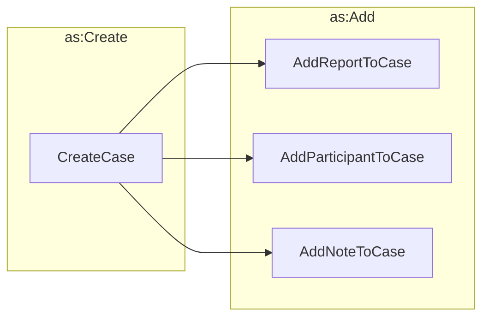

# Initializing a Case



## Create Case

```python exec="true" idprefix=""
from vultron.scripts.vocab_examples import create_case, json2md

print(json2md(create_case()))
```

## Add Report to Case

```python exec="true" idprefix=""
from vultron.scripts.vocab_examples import add_report_to_case, json2md

print(json2md(add_report_to_case()))
```

## Add Participant to Case

Vendor adds self to case.

```python exec="true" idprefix=""
from vultron.scripts.vocab_examples import add_vendor_participant_to_case, json2md

print(json2md(add_vendor_participant_to_case()))
```

Vendor adds finder to case.

```python exec="true" idprefix=""
from vultron.scripts.vocab_examples import add_finder_participant_to_case, json2md

print(json2md(add_finder_participant_to_case()))
```
