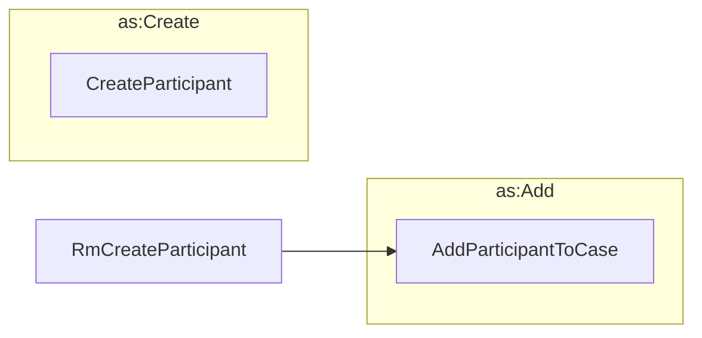

# Initializing a CaseParticipant

```mermaid
flowchart LR
    subgraph as:Create
        CreateParticipant
    end
    subgraph as:Add
        AddParticipantToCase
    end
    RmCreateParticipant --> AddParticipantToCase
```



