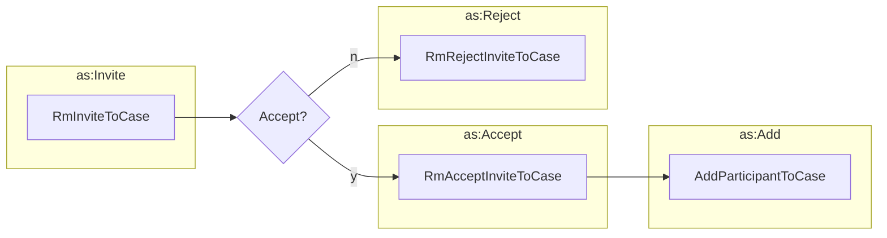

# Inviting an Actor to a Case





## Accept Invite to Case

```python exec="true" idprefix=""
from vultron.scripts.vocab_examples import accept_invite_to_case, json2md

print(json2md(accept_invite_to_case()))
```

## Reject Invite to Case

```python exec="true" idprefix=""
from vultron.scripts.vocab_examples import reject_invite_to_case, json2md

print(json2md(reject_invite_to_case()))
```

## Add Participant to Case

```python exec="true" idprefix=""
from vultron.scripts.vocab_examples import add_coordinator_participant_to_case, json2md

print(json2md(add_coordinator_participant_to_case()))
```
