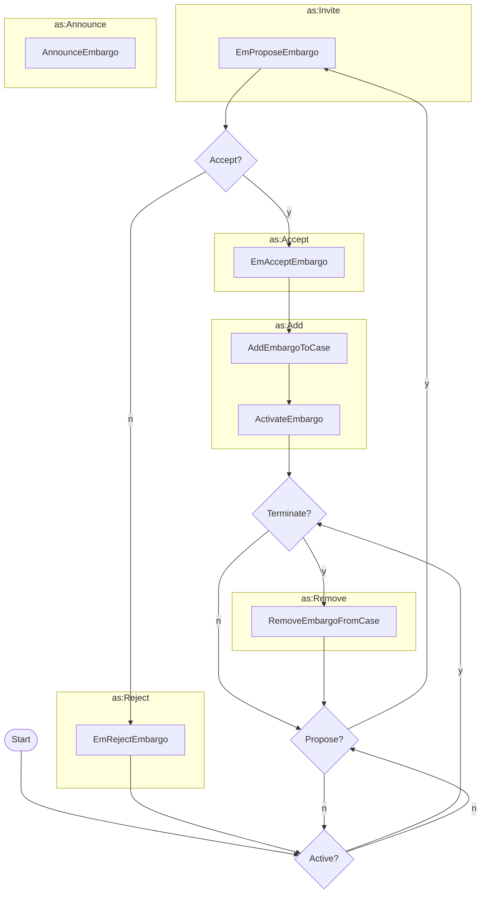

# Managing an Embargo

Once established, an embargo can be modified via a propose/accept/reject cycle.
It can also be terminated or removed from a case.

!!! tip "Announce Embargo"

    The `AnnounceEmbargo` activity is used to indicate that an embargo has been
    established or to remind participants of its status. It is used to announce
    the embargo to the case participants. It is also used to draw attention to
    significant changes to the embargo status over and above the corresponding 
    CaseStatus messages, such as when an embargo is deactivated or removed from
    a case.

