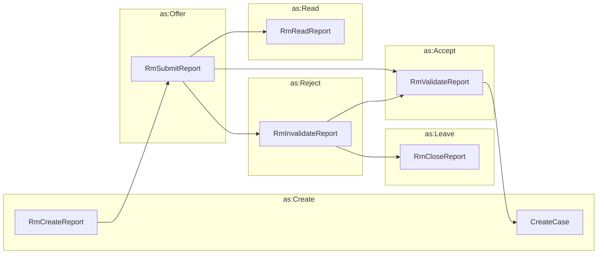

# Reporting a Vulnerability



## Create Report

```python exec="true" idprefix=""
from vultron.scripts.vocab_examples import create_report, json2md

print(json2md(create_report()))
```

## Submit Report

```python exec="true" idprefix=""
from vultron.scripts.vocab_examples import submit_report, json2md

print(json2md(submit_report()))
```

## Read Report

```python exec="true" idprefix=""
from vultron.scripts.vocab_examples import read_report, json2md

print(json2md(read_report()))
```

## Validate Report

```python exec="true" idprefix=""
from vultron.scripts.vocab_examples import validate_report, json2md

print(json2md(validate_report()))
```

## Invalidate Report

```python exec="true" idprefix=""
from vultron.scripts.vocab_examples import invalidate_report, json2md

print(json2md(invalidate_report()))
```

## Close Report

```python exec="true" idprefix=""
from vultron.scripts.vocab_examples import close_report, json2md

print(json2md(close_report()))
```

## Create Case

```python exec="true" idprefix=""
from vultron.scripts.vocab_examples import create_case, json2md

print(json2md(create_case()))
```
