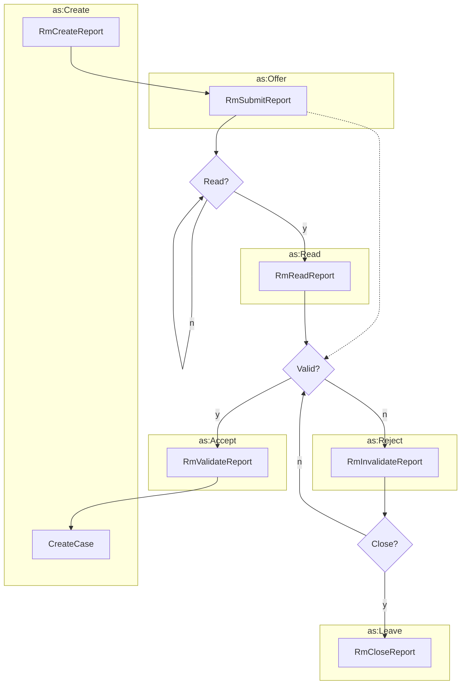

# Reporting a Vulnerability

```mermaid
flowchart TB
    subgraph as:Create
        RmCreateReport
        CreateCase
    end
    subgraph as:Read
        RmReadReport
    end
    subgraph as:Offer
        RmSubmitReport
    end
    subgraph as:Accept
        RmValidateReport
    end
    subgraph as:Reject
        RmInvalidateReport
    end
    subgraph as:Leave
        RmCloseReport
    end
    
    RmCreateReport --> RmSubmitReport
    RmSubmitReport -.-> v{Valid?}
    RmSubmitReport --> r{Read?}
    r -->|y| RmReadReport
    r -->|n| r
    v -->|y| RmValidateReport
    RmReadReport --> v
    v -->|n| RmInvalidateReport
    RmInvalidateReport --> c{Close?}
    c -->|y| RmCloseReport
    c -->|n| v
    RmValidateReport --> CreateCase
```







