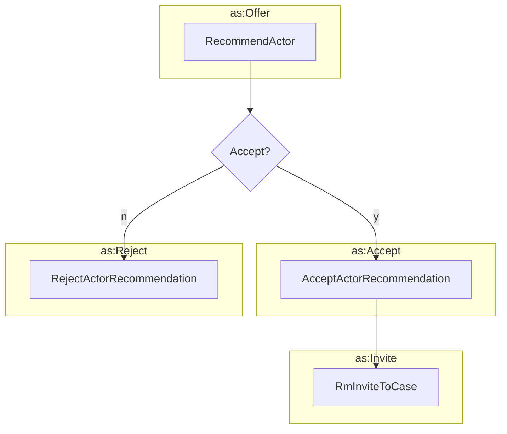

# Suggesting an Actor for a Case



## Recommend Actor

```python exec="true" idprefix=""
from vultron.scripts.vocab_examples import recommend_actor, json2md

print(json2md(recommend_actor()))
```

## Accept Actor Recommendation

```python exec="true" idprefix=""
from vultron.scripts.vocab_examples import accept_actor_recommendation, json2md

print(json2md(accept_actor_recommendation()))
```

## Reject Actor Recommendation

```python exec="true" idprefix=""
from vultron.scripts.vocab_examples import reject_actor_recommendation, json2md

print(json2md(reject_actor_recommendation()))
```




