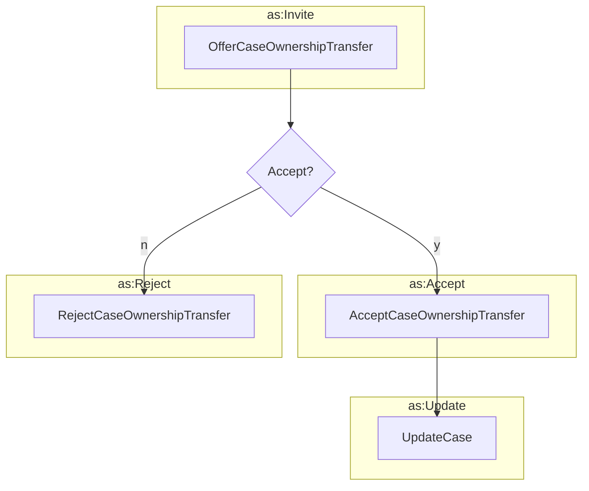

# Transferring Case Ownership

This was not part of the original Vultron protocol, but it seems like a
reasonable extension that could be useful in some cases, such as transferring a
case

- from a researcher to a vendor
- from a vendor to an upstream vendor
- from a vendor to a coordinator
- from a coordinator to a vendor
- between coordinators



## Offer Case Ownership Transfer

```python exec="true" idprefix=""
from vultron.scripts.vocab_examples import offer_case_ownership_transfer, json2md

print(json2md(offer_case_ownership_transfer()))
```

## Accept Case Ownership Transfer

```python exec="true" idprefix=""
from vultron.scripts.vocab_examples import accept_case_ownership_transfer, json2md

print(json2md(accept_case_ownership_transfer()))
```

## Reject Case Ownership Transfer

```python exec="true" idprefix=""
from vultron.scripts.vocab_examples import reject_case_ownership_transfer, json2md

print(json2md(reject_case_ownership_transfer()))
```

## Update Case

```python exec="true" idprefix=""
from vultron.scripts.vocab_examples import update_case, json2md

print(json2md(update_case()))
```
